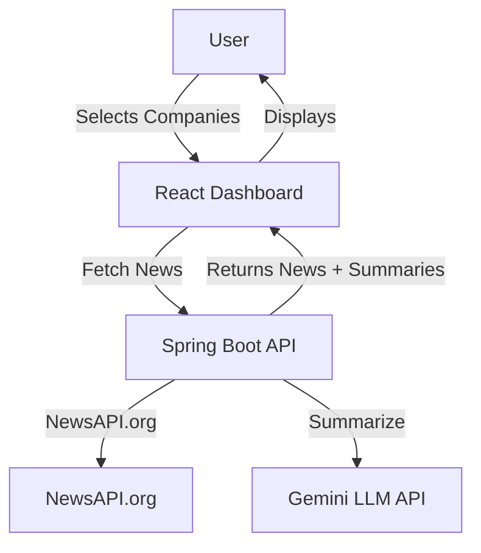
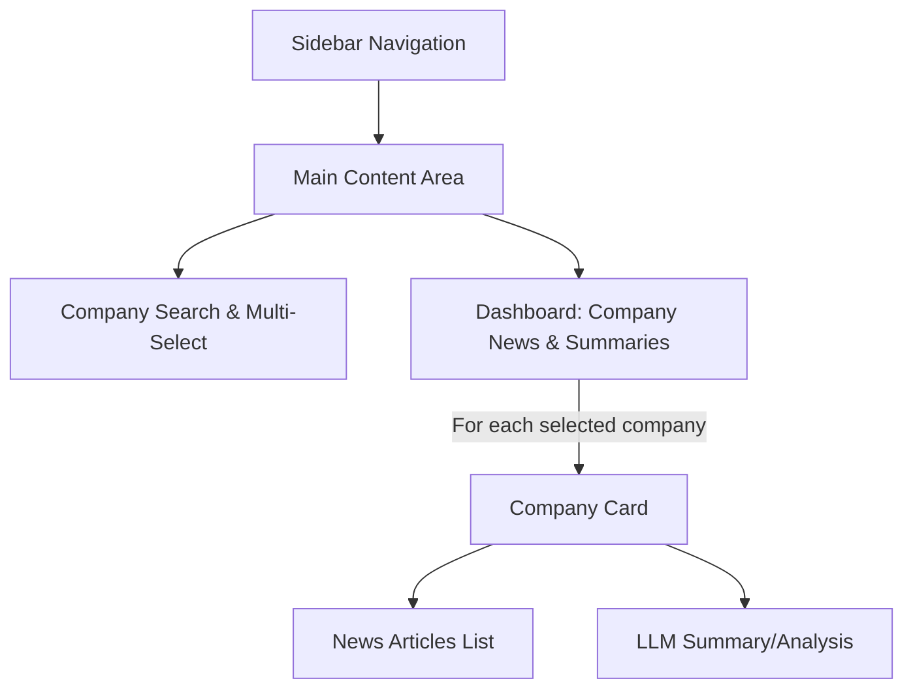

# Market Digest AI

## Project Overview

**Market Digest AI** is a web dashboard that enables users to search, filter, and select companies worldwide, then view the latest news and trending information about those companies. The dashboard fetches real-time news using NewsAPI.org and leverages the Gemini LLM API to generate summaries, extract key points, and provide sentiment/context analysis for each company's news. 
---

## Technologies Used

- **Backend:** Java Spring Boot (REST API)
- **Frontend:** React (with Material UI)
- **APIs:** 
  - [NewsAPI.org](https://newsapi.org/) (for news)
  - Gemini LLM API (for summarization/analysis, using local API key)
- **Other:** Responsive design, dark mode, card-based UI

---

## Project Goals

- Provide a unified dashboard for monitoring company news and trends.
- Enable multi-company selection and comparison.
- Summarize and analyze news using state-of-the-art LLMs.
- Deliver a visually appealing, responsive, and user-friendly experience.

---

## Key Features

- **Company Selection & Filtering:** Search and multi-select companies from a global list.
- **News Fetching:** Retrieve latest and trending news for each selected company.
- **LLM Summarization/Analysis:** Summarize news, extract key points, and analyze sentiment/context using Gemini LLM.
- **Interactive Dashboard UI:** Modern, card-based, dark-themed, and responsive interface.
- **Separation of Concerns:** Clean API boundaries between frontend and backend.

---

## High-Level Design



- **Frontend:** Handles company selection, displays news and summaries, manages UI state.
- **Backend:** Orchestrates news fetching, LLM summarization, and API key management.

---

## Example API Usage

### NewsAPI.org
```
GET https://newsapi.org/v2/everything?q={company}&sortBy=publishedAt&apiKey=NEWS_API_KEY
```

### Backend Endpoints
- `GET /api/companies` — List/search companies
- `POST /api/news` — Fetch news for selected companies
  - Request: `{ "companies": ["Apple", "Microsoft"] }`
  - Response: `{ "Apple": [ ...articles ], "Microsoft": [ ...articles ] }`
- `POST /api/summarize` — Summarize/analyze news articles
  - Request: `{ "company": "Apple", "articles": [ ... ] }`
  - Response: `{ "summary": "...", "keyPoints": [ ... ], "sentiment": "Positive" }`

---

## Spring Boot Concepts to be Used

- **REST Controllers:** Define API endpoints for frontend communication.
- **Service Layer:** Encapsulate business logic (news fetching, LLM calls).
- **Configuration:** Manage API keys and environment variables securely.
- **Async Processing:** Handle multiple company/news requests efficiently.
- **Error Handling:** Robust error responses for API failures.
- **Security:** Protect API keys and sensitive endpoints.


---

## Getting Started

1. Clone the repo.
2. Set up API keys for NewsAPI.org and Gemini LLM in environment/config files.
3. Run backend (`Spring Boot`) and frontend (`React`) servers.
4. Access the dashboard in your browser.

---

## License

MIT 

## Frontend UI Wireframe & Plan

### High-Level Layout



### UI Sections & Components

- **Sidebar Navigation**
  - App name/logo
  - Navigation links (Dashboard, About, etc.)
  - Dark mode toggle

- **Main Content Area**
  - **Company Search & Multi-Select**
    - Search bar with autocomplete
    - Multi-select dropdown (Material UI Autocomplete/Select)
    - Option to clear selection
  - **Dashboard**
    - For each selected company:
      - **Company Card**
        - Company name & logo
        - **News Articles List**
          - List of latest news (title, source, published date, link)
        - **LLM Summary/Analysis**
          - Summary text
          - Key points (bulleted)
          - Sentiment (icon or color)
        - Refresh button (re-fetch news & summary)

### User Flow
1. User lands on dashboard (dark theme by default)
2. User searches for and selects one or more companies
3. For each selected company:
    - News articles are fetched and displayed
    - LLM summary, key points, and sentiment are shown
4. User can refresh data, change selection, or navigate via sidebar

### UI/UX Inspiration
- Card-based layout (Material UI Cards)
- Responsive grid (Material UI Grid)
- Sidebar navigation (Drawer)
- Dark/light mode toggle
- Loading skeletons for async data
- Error messages for failed API calls 

---

## Recent Updates (2025)

- **Backend:**
  - Enhanced Gemini LLM prompt for more detailed, multi-paragraph summaries suitable for business/finance users.
  - Added robust logging for Gemini API responses and errors to aid debugging and transparency.
  - Improved error handling for LLM/API failures, with clear fallback behavior.
  - Updated Gemini API endpoint configuration to use the correct v1 model path.
- **Frontend:**
  - Company summary cards now support multi-paragraph summaries and preserve formatting for better readability.
  - No truncation of summaries; full AI output is visible to the user.
- **DevOps:**
  - Project structure and codebase pushed to GitHub ([Fullstack-Development](https://github.com/sahilsoni960/Fullstack-Development)).

---

## Troubleshooting & Tips

- **Gemini API 404 or Model Not Found:**
  - Ensure your `application.properties` uses the correct endpoint:
    ```
    llm.gemini.api.url=https://generativelanguage.googleapis.com/v1/models/gemini-pro:generateContent?key=${GEMINI_API_KEY}
    ```
  - The old `v1beta` endpoint is deprecated and will cause errors.
- **LLM Summaries Not Showing or Truncated:**
  - Check backend logs for Gemini API errors or parsing issues.
  - Make sure your API key is valid and has access to Gemini Pro.
- **Frontend Not Showing Full Summary:**
  - The summary card now uses `white-space: pre-line` and supports multi-paragraph text for full visibility. 

---

## Health Check Endpoint

- **Endpoint:** `GET /api/health`
- **Purpose:** Returns a simple status to indicate the backend server is running and healthy.
- **Usage:** Used by monitoring tools, load balancers, or for manual checks to verify backend availability.
- **Sample Response:**
  ```json
  { "status": "UP" }
  ``` 